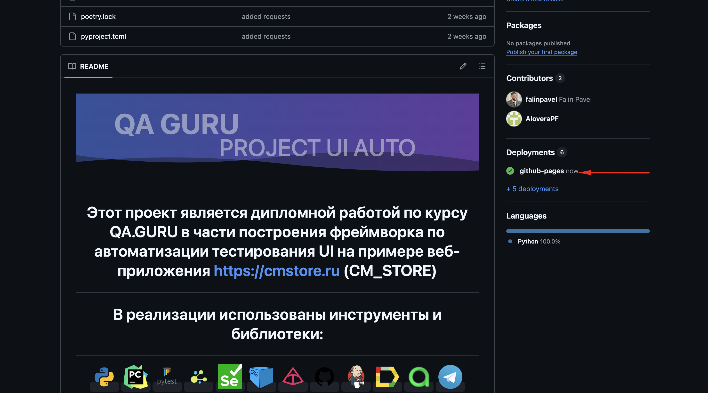
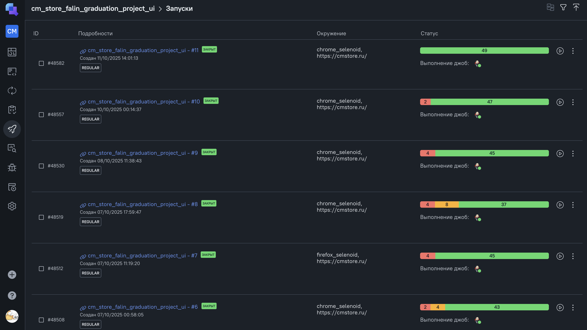
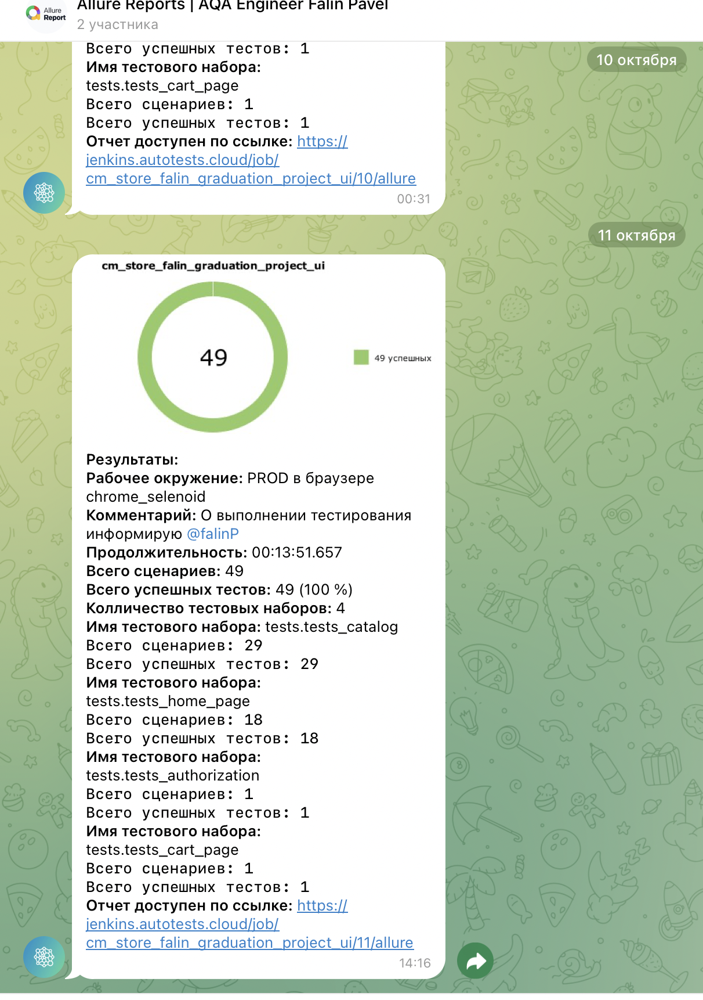

# <p  align="center"> Этот проект является дипломной работой по курсу QA.GURU в части построения фреймворка по автоматизации тестирования UI на примере веб-приложения https://cmstore.ru (CM_STORE)

# <p  align="center"> В реализации использованы инструменты и библиотеки:

<p  align="center">
  <code></code>
  <code></code>
  <code></code>
  <code></code>
  <code></code>
  <code></code>
  <code></code>
  <code></code>
  <code></code>
  <code></code>
  <code></code>
  <code></code>
  <code></code>
</p>

##  Ведео прохождения теста:
<p align="center">

</p>

##  Для локального запуска тестов:

1) Клонировать репозиторий: git clone git@github.com:falinpavel/qa_guru_graduation_project_ui.git
2) Установить зависимости (в проекте используется poetry): poetry init -> poetry install -> poetry env activate
3) Запуск всех тестов с генерацией отчетов Allure использовать команду: pytest (все параметры запуска зашиты в pyproject.toml)
4) Просмотр отчета Allure (если установлен Allure CLI): allure serve reports/allure-results

##  Для запуска тестов в Jenkins:

1) Авторизоваться в Jenkins
2) Перейти в одноименную с репозиторием джобу
3) Для запуска тестов в Jenkins нажать "Build with parameters"
4) Нажать "Build"

<p></p>
<p></p>

##  Визуализация результатов (Allure Reports и Allure TestOps)

## Если тесты запускались локально, то сгенерированный Allure отчет можно посмотрь выполнив команду в терминале: 

```bash
allure serve reports/allure-results
```
## Если тесты запускались в Jenkins, то результаты можно посмотреть кликнув по иконке Allure Report в Jenkins в завершенной сборке:

<p></p>
<p></p>
<p></p>

##  Allure отчет так же можно посмотреть на GitHub в разделе Deployments (https://github.com/falinpavel/qa_guru_graduation_project_ui/deployments) данного репозитория (Тестовый прогон выполняется после каждого push в ветку main и публикуется на github-pages, см. подробнее в test.yaml)

<p></p>

##  Для просмотра результатов тестового прогона в Allure TestOps кликнув на соответствующую ему иконку в джобе Jenkins:

<p></p>
<p></p>
<p></p>

##  Интеграция с Telegram в Jenkins для автоматической отправки результатов тестового прогона через бота

<p></p>